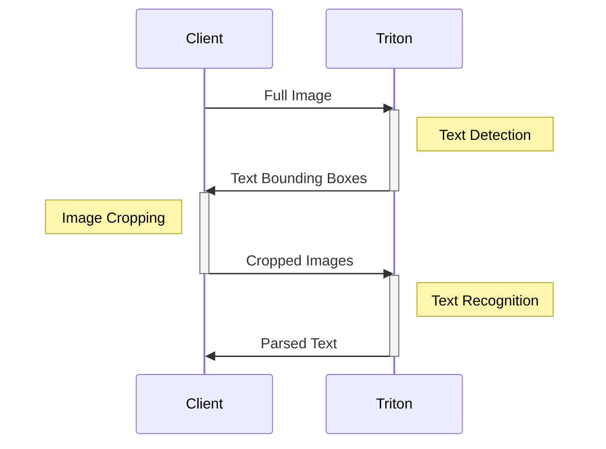
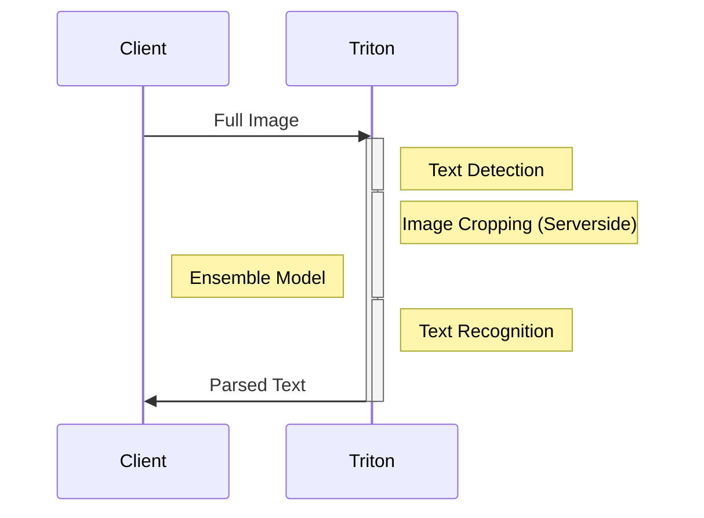
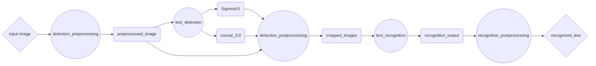

<!--
# Copyright 2023, NVIDIA CORPORATION & AFFILIATES. All rights reserved.
#
# Redistribution and use in source and binary forms, with or without
# modification, are permitted provided that the following conditions
# are met:
#  * Redistributions of source code must retain the above copyright
#    notice, this list of conditions and the following disclaimer.
#  * Redistributions in binary form must reproduce the above copyright
#    notice, this list of conditions and the following disclaimer in the
#    documentation and/or other materials provided with the distribution.
#  * Neither the name of NVIDIA CORPORATION nor the names of its
#    contributors may be used to endorse or promote products derived
#    from this software without specific prior written permission.
#
# THIS SOFTWARE IS PROVIDED BY THE COPYRIGHT HOLDERS ``AS IS'' AND ANY
# EXPRESS OR IMPLIED WARRANTIES, INCLUDING, BUT NOT LIMITED TO, THE
# IMPLIED WARRANTIES OF MERCHANTABILITY AND FITNESS FOR A PARTICULAR
# PURPOSE ARE DISCLAIMED.  IN NO EVENT SHALL THE COPYRIGHT OWNER OR
# CONTRIBUTORS BE LIABLE FOR ANY DIRECT, INDIRECT, INCIDENTAL, SPECIAL,
# EXEMPLARY, OR CONSEQUENTIAL DAMAGES (INCLUDING, BUT NOT LIMITED TO,
# PROCUREMENT OF SUBSTITUTE GOODS OR SERVICES; LOSS OF USE, DATA, OR
# PROFITS; OR BUSINESS INTERRUPTION) HOWEVER CAUSED AND ON ANY THEORY
# OF LIABILITY, WHETHER IN CONTRACT, STRICT LIABILITY, OR TORT
# (INCLUDING NEGLIGENCE OR OTHERWISE) ARISING IN ANY WAY OUT OF THE USE
# OF THIS SOFTWARE, EVEN IF ADVISED OF THE POSSIBILITY OF SUCH DAMAGE.
-->


# Executing Multiple Models with Model Ensembles

| Navigate to | [Part 4: Accelerating Models](../Part_4-inference_acceleration/)  | [Part 6: Using the BLS API to build complex pipelines](../Part_6-building_complex_pipelines/) | [Documentation: Ensembles](https://docs.nvidia.com/deeplearning/triton-inference-server/user-guide/docs/user_guide/architecture.html#ensemble-models)
| ------------ | --------------- | --------------- | --------------- |

Modern machine learning systems often involve the execution of several models, whether that is because of pre- and post-processing steps, aggregating the prediction of multiple models, or having different models executing different tasks.  In this example, we'll be exploring the use of Model Ensembles for executing multiple models server side with only a single network call. This offers the benefit of reducing the number of times we need to copy data between the client and the server, and eliminating some of the latency inherent to network calls.

To illustrate the process of creating a model ensemble, we'll be reusing the model pipeline first introduced in [Part 1](../Part_1-model_deployment/README.md). In the previous examples, we've executed the text detection and recognition models separately, with our client making two different network calls and performing various processing steps -- such as cropping and resizing images, or decoding tensors into text -- in between. Below is a simplified diagram of the pipeline, with some steps occurring on the client and some on the server.



In order to reduce the number of network calls and data copying necessary (and also take advantage of the potentially more powerful server to perform pre/post processing), we can use Triton's [Model Ensemble](https://docs.nvidia.com/deeplearning/triton-inference-server/user-guide/docs/user_guide/architecture.html#ensemble-models) feature to execute multiple models with one network call.


Let's go over how to create a Triton model ensemble.

**Note:** If you are looking for an example to understand how the data flows through the ensemble, [refer this tutorial](../../Feature_Guide/Data_Pipelines/README.md)!

## Deploy Base Models
The first step is to deploy the text detection and text recognition models as regular Triton models, just as we've done in the past. For a detailed overview of deploying models to Triton, see [Part 1](../Part_1-model_deployment/README.md) of this tutorial. For convenience, we've included two shell scripts for exporting these models.

>Note: We recommend executing the following step within the NGC TensorFlow container environment, which you can launch with `docker run -it --gpus all -v ${PWD}:/workspace nvcr.io/nvidia/tensorflow:<yy.mm>-tf2-py3`
```bash
bash utils/export_text_detection.sh
```

>Note: We recommend executing the following step within the NGC PyTorch container environment, which you can launch with `docker run -it --gpus all -v ${PWD}:/workspace nvcr.io/nvidia/pytorch:<yy.mm>-py3`
```bash
bash utils/export_text_recognition.sh
```

## Deploy Pre/Post Processing Scripts with the Python Backend
In previous parts of this this tutorial, we've created client scripts that perform various pre and post processing steps within the client process. For example, in [Part 1](../Part_1-model_deployment/README.md), we created a script [`client.py`](../Part_1-model_deployment/clients/client.py) which
1. Read in images
2. Performed scaling and normalization on the image
3. Sent the images to the Triton server
4. Cropped the images based on the bounding boxes returned by the text detection model
5. Saved the cropped images back to disk

Then, we had a second client, [`client2.py`](../Part_1-model_deployment/clients/client2.py), which
1. Read in the cropped images from `client.py`
2. Performed scaling and normalization on the images
3. Sent the cropped images to the Triton server
4. Decoded the tensor returned by the text recognition model into text
5. Printed the decoded text

In order to move many of these steps to the Triton server, we can create a set of scripts that will run in the [Python Backend for Triton](https://github.com/triton-inference-server/python_backend). The Python backend can be used to execute any Python code, so we can port our client code directly over to Triton with only a few changes.

To deploy a model for the Python Backend, we can create a directory in our model repository as below (where `my_python_model` can be any name):

```
my_python_model/
├── 1
│   └── model.py
└── config.pbtxt
```

In total, we'll create 3 different python backend models to go with our existing ONNX models to serve with Triton:
1. `detection_preprocessing`
2. `detection_postprocessing`
3. `recognition_postprocessing`

You can find the complete `model.py` scripts for each of these in the `model_repository` folder in this directory.

Let's go through an example. Within `model.py`, we create a class definition for `TritonPythonModel` with the following methods:

```python
class TritonPythonModel:
    def initialize(self, args):
        ...
    def execute(self, requests):
        ...
    def finalize(self):
        ...
```

The `initialize` and `finalize` methods are optional, and are called when the model is loaded and unloaded respectively. The bulk of logic will go into the `execute` method, which takes in a _list_ of request objects, and must return a list of response objects.

In our original client, we had the following code to read in an image and perform some simple transformations to it:

```python
### client.py

image = cv2.imread("./img1.jpg")
image_height, image_width, image_channels = image.shape

# Pre-process image
blob = cv2.dnn.blobFromImage(image, 1.0, (inpWidth, inpHeight), (123.68, 116.78, 103.94), True, False)
blob = np.transpose(blob, (0, 2,3,1))

# Create input object
input_tensors = [
    httpclient.InferInput('input_images:0', blob.shape, "FP32")
]
input_tensors[0].set_data_from_numpy(blob, binary_data=True)
```

When executing in the python backend, we need to make sure that our code can handle a list of inputs. In addition, we won't be reading in the images from disk -- instead, we'll retrieve them directly from the input tensor that's provided by the Triton server.

```python
### model.py

responses = []
for request in requests:
    # Read input tensor from Triton
    in_0 = pb_utils.get_input_tensor_by_name(request, "detection_preprocessing_input")
    img = in_0.as_numpy()
    image = Image.open(io.BytesIO(img.tobytes()))

    # Pre-process image
    img_out = image_loader(image)
    img_out = np.array(img_out)*255.0

    # Create object to send to next model
    out_tensor_0 = pb_utils.Tensor("detection_preprocessing_output", img_out.astype(output0_dtype))
    inference_response = pb_utils.InferenceResponse(output_tensors=[out_tensor_0])
    responses.append(inference_response)
return responses
```


## Tying the models together with Model Ensembles
Now that we have every individual part of our pipeline ready to deploy individually, we can create an ensemble "model" that can execute each model in order, and pass the various inputs and outputs between each model.

To do this, we'll create another entry in our model repository
```
ensemble_model/
├── 1
└── config.pbtxt
```
This time, we only need the configuration file to describe our ensemble along with an empty version folder (which you will need to create with `mkdir -p model_repository/ensemble_model/1`). Within the config file, we'll define the execution graph of our ensemble. This graph describes what the overall inputs and outputs of the ensemble will be, as well as how the data will flow through the models in the form of a Directed Acyclic Graph. Below is a graphical representation of our model pipeline. The diamonds represent the final input and output of the ensemble, which is all the client will interact with. The circles are the different deployed models, and the rectangles are the tensors that get passed between models.



To represent this graph to Triton, we'll create the below config file. Notice how we define the platform as `"ensemble"` and specify the inputs and outputs of the ensemble itself. Then, in the `ensemble_scheduling` block, we create an entry for each `step` of the ensemble that includes the name of the model to be executed, and how that model's inputs and outputs map to the inputs and outputs of either the full ensemble or the other models.

<details>
<summary> Expand for ensemble config file </summary>

```text proto
name: "ensemble_model"
platform: "ensemble"
max_batch_size: 256
input [
  {
    name: "input_image"
    data_type: TYPE_UINT8
    dims: [ -1 ]
  }
]
output [
  {
    name: "recognized_text"
    data_type: TYPE_STRING
    dims: [ -1 ]
  }
]

ensemble_scheduling {
  step [
    {
      model_name: "detection_preprocessing"
      model_version: -1
      input_map {
        key: "detection_preprocessing_input"
        value: "input_image"
      }
      output_map {
        key: "detection_preprocessing_output"
        value: "preprocessed_image"
      }
    },
    {
      model_name: "text_detection"
      model_version: -1
      input_map {
        key: "input_images:0"
        value: "preprocessed_image"
      }
      output_map {
        key: "feature_fusion/Conv_7/Sigmoid:0"
        value: "Sigmoid:0"
      },
      output_map {
        key: "feature_fusion/concat_3:0"
        value: "concat_3:0"
      }
    },
    {
      model_name: "detection_postprocessing"
      model_version: -1
      input_map {
        key: "detection_postprocessing_input_1"
        value: "Sigmoid:0"
      }
      input_map {
        key: "detection_postprocessing_input_2"
        value: "concat_3:0"
      }
      input_map {
        key: "detection_postprocessing_input_3"
        value: "preprocessed_image"
      }
      output_map {
        key: "detection_postprocessing_output"
        value: "cropped_images"
      }
    },
    {
      model_name: "text_recognition"
      model_version: -1
      input_map {
        key: "INPUT__0"
        value: "cropped_images"
      }
      output_map {
        key: "OUTPUT__0"
        value: "recognition_output"
      }
    },
    {
      model_name: "recognition_postprocessing"
      model_version: -1
      input_map {
        key: "recognition_postprocessing_input"
        value: "recognition_output"
      }
      output_map {
        key: "recognition_postprocessing_output"
        value: "recognized_text"
      }
    }
  ]
}
```

</details>

## Launching Triton
We'll again be launching Triton using docker containers. This time, we'll start an interactive session within the container instead of directly launching the triton server.

```bash
docker run --gpus=all -it --shm-size=256m --rm  \
  -p8000:8000 -p8001:8001 -p8002:8002 \
  -v ${PWD}:/workspace/ -v ${PWD}/model_repository:/models \
  nvcr.io/nvidia/tritonserver:22.12-py3
```

We'll need to install a couple of dependencies for our Python backend scripts.

```bash
pip install torchvision opencv-python-headless
```

Then, we can launch Triton
```bash
tritonserver --model-repository=/models
```

## Creating a new client

Now that we've moved much of the complexity of our previous client into different Triton backend scripts, we can create a much simplified client to communicate with Triton.

```python
## client.py

import tritonclient.grpc as grpcclient
import numpy as np

client = grpcclient.InferenceServerClient(url="localhost:8001")

image_data = np.fromfile("img1.jpg", dtype="uint8")
image_data = np.expand_dims(image_data, axis=0)

input_tensors = [grpcclient.InferInput("input_image", image_data.shape, "UINT8")]
input_tensors[0].set_data_from_numpy(image_data)
results = client.infer(model_name="ensemble_model", inputs=input_tensors)
output_data = results.as_numpy("recognized_text").astype(str)
print(output_data)
```

Now, run the full inference pipeline by executing the following command
```
python client.py
```
You should see the parsed text printed out to your console.

## What's Next
In this example, we showed how you can use Model Ensembles to execute multiple models on Triton with a single network call. Model Ensembles are a great solution when your model pipelines are in the form of a Directed Acyclic Graph. However, not all pipelines can be expressed this way. For example, if your pipeline logic requires conditional branching or looped execution, you might need a more expressive way to define your pipeline. In the [next example](../Part_6-building_complex_pipelines/), we'll explore how you can create define more complex pipelines in Python using [Business Logic Scripting](https://github.com/triton-inference-server/python_backend#business-logic-scripting).