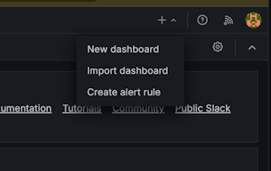
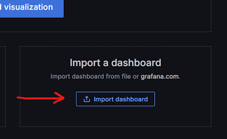
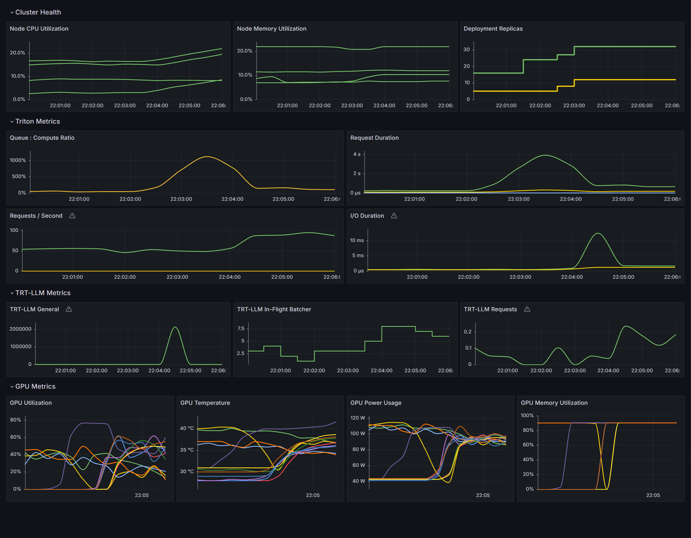
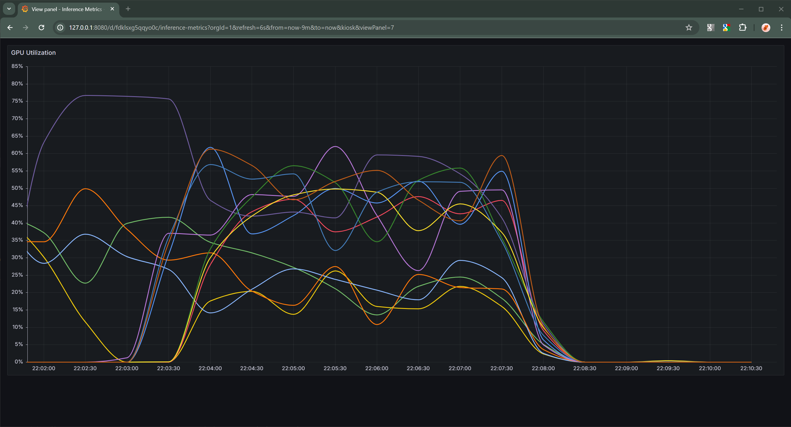
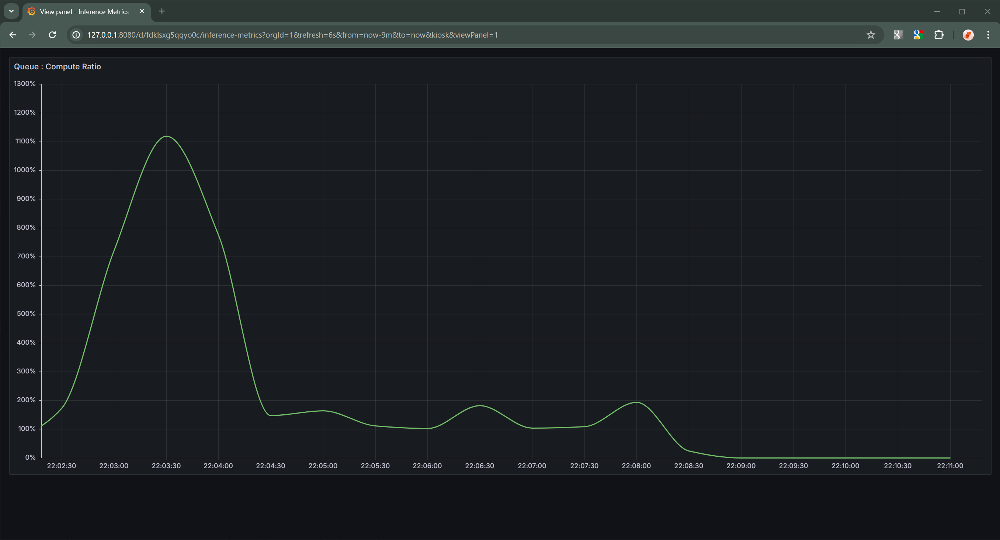

<!---
# Copyright (c) 2024, NVIDIA CORPORATION. All rights reserved.
#
# Licensed under the Apache License, Version 2.0 (the "License");
# you may not use this file except in compliance with the License.
# You may obtain a copy of the License at
#
#     http://www.apache.org/licenses/LICENSE-2.0
#
# Unless required by applicable law or agreed to in writing, software
# distributed under the License is distributed on an "AS IS" BASIS,
# WITHOUT WARRANTIES OR CONDITIONS OF ANY KIND, either express or implied.
# See the License for the specific language governing permissions and
# limitations under the License.
--->

# Autoscaling and Load Balancing Generative AI w/ Triton Server and TensorRT-LLM

Setting up autoscaling and load balancing for large language models served by Triton Inference Server is not difficult,
but does require preparation.

This guide outlines the steps to download models from Hugging Face, optimize them for TensorRT, and configure automatic scaling and load balancing in Kubernetes.
TensorRT, and configuring automatic scaling and load balancing for your models. This guide does not cover Kubernetes'
basics, secure ingress/egress from your cluster to external clients, nor cloud provider interfaces or implementations of
Kubernetes.

When configured properly autoscaling enables LLM based services to allocate and deallocate resources automatically based on the current load.
adapt to the current workload intensity.
In this tutorial, as the number of clients grow for a given Triton Server deployment, the inference load on the server increases
and the queue-to-compute ratio will eventually cause the horizontal pod autoscaler to increase the number of Triton Server
instancing handle requests until the desired ratio is achieved.
Inversely, decreasing the number of clients will reduce the number of Triton Server instances deployed.

We'll cover the following topics:

* [Cluster Setup](#cluster-setup)
  * [Core Cluster Services](#core-cluster-services)
    * [Kubernetes Node Feature Discovery service](#kubernetes-node-feature-discovery-service)
    * [NVIDIA Device Plugin for Kubernetes](#nvidia-device-plugin-for-kubernetes)
    * [NVIDIA GPU Feature Discovery service](#nvidia-gpu-feature-discovery-service)
  * [Metrics Collection Services](#metrics-collection-services)
    * [Create a Monitoring Namespace](#create-a-monitoring-namespace)
    * [Prometheus Services](#prometheus-services)
    * [NVIDIA Data Center GPU Manager (DCGM) Exporter](#nvidia-data-center-gpu-manager-dcgm-exporter)
    * [Connect DCGM and Triton Metrics to Prometheus](#connect-dcgm-and-triton-metrics-to-prometheus)
    * [Triton Metrics Prometheus Rule](#triton-metrics-prometheus-rule)
  * [Hugging Face Authorization](#hugging-face-authorization)
* [Triton Preparation](#triton-preparation)
  * [Model Preparation Script](#model-preparation-script)
  * [Custom Container Image](#custom-container-image)
  * [Kubernetes Pull Secrets](#kubernetes-pull-secrets)
* [Triton Deployment](#triton-deployment)
  * [Deploying Single GPU Models](#deploying-single-gpu-models)
  * [Deploying Models Too Large for a Single GPU](#deploying-models-too-large-for-a-single-gpu)
  * [Utilizing Multiple GPU SKUs](#utilizing-multiple-gpu-skus)
  * [Monitoring Triton in Kubernetes](#monitoring-triton-in-kubernetes)
* [Developing this Guide](#developing-this-guide)

Prior to beginning this guide/tutorial you will need a couple of things.

* Kubernetes Control CLI (`kubectl`)
  [ [documentation](https://kubernetes.io/docs/reference/kubectl/introduction/)
  | [download](https://kubernetes.io/releases/download/) ]
* Helm CLI (`helm`)
  [ [documentation](https://helm.sh/)
  | [download](https://helm.sh/docs/intro/install) ]
* Docker CLI (`docker`)
  [ [documentation](https://docs.docker.com/)
  | [download](https://docs.docker.com/get-docker/) ]
* Decent text editing software for editing YAML files.
* Kubernetes cluster.
* Fully configured `kubectl` with administrator permissions to the cluster.

## Cluster Setup

The following instructions detail how to set up Horizontal Pod Autoscaling (HPA) for Triton Inference Server in a Kubernetes cluster.


### Prerequisites

This guide assumes that all nodes with NVIDIA GPUs have the following:
- A node label of `nvidia.com/gpu=present` to more easily identify nodes with NVIDIA GPUs.
- A node taint of `nvidia.com/gpu=present:NoSchedule` to prevent non-GPU pods from being deployed to GPU nodes.

> [!Tip]
> When using a Kubernetes provider like AKS, EKA, or GKE, it is usually best to use their interface when configuring nodes
> instead of using `kubectl` to do it directly.


### Core Cluster Services

Once all nodes are correctly labeled and tainted, use the following steps to prepare the cluster to collect and serve the
necessary metrics to enable automated horizontal pod autoscaling for Triton Server.

The following series of steps are intended to prepare a fresh cluster.
For clusters in varying states, it is best to coordinate with your cluster administrator before installing new services and
capabilities.

#### Kubernetes Node Feature Discovery service

1.  Add the Kubernetes Node Feature Discovery chart repository to the local cache.

    ```bash
    helm repo add kube-nfd https://kubernetes-sigs.github.io/node-feature-discovery/charts \
      && helm repo update
    ```

2.  Run the command below to install the service.

    ```bash
    helm install -n kube-system node-feature-discovery kube-nfd/node-feature-discovery \
      --set nameOverride=node-feature-discovery \
      --set worker.tolerations[0].key=nvidia.com/gpu \
      --set worker.tolerations[0].operator=Exists \
      --set worker.tolerations[0].effect=NoSchedule
    ```

    > [!Note]
    > The above command sets toleration values which allow for the deployment of a pod onto a node with
    > a matching taint.
    > See this document's [prerequisites](#prerequisites) for the taints this document expected to have been applied to GPU
    > nodes in the cluster.

#### NVIDIA Device Plugin for Kubernetes

1.  This step is not needed if the Device Plugin has already been installed in your cluster.
    Cloud providers with turnkey Kubernetes clusters, such as those from AKS, EKS, and GKE, often install the Device Plugin automatically when a GPU node is added to the cluster.
    automatically once a GPU node as been added to the cluster.

    To check if your cluster requires the NVIDIA Device Plugin for Kubernetes, run the following command and inspect
    the output for `nvidia-device-plugin-daemonset`.

    ```bash
    kubectl get daemonsets --all-namespaces
    ```

    Example output:
    ```text
    NAME                                          DESIRED  CURRENT  READY  UP-TO-DATE  AVAILABLE
    kube-proxy                                    6        6        6      6           6
    kube-system   node-feature-discovery-worker   1        1        1      1           1
    nvidia-device-plugin-daemonset                6        6        6      6           6
    ```

2.  If `nvidia-device-plugin-daemonset` is not listed, run the command below to install the plugin.
    Once installed it will provide containers access to GPUs in your clusters.

    For additional information, see
    [Github/NVIDIA/k8s-device-plugin](https://github.com/NVIDIA/k8s-device-plugin/blob/main/README.md).

    ```bash
    kubectl create -f https://raw.githubusercontent.com/NVIDIA/k8s-device-plugin/v0.15.0/deployments/static/nvidia-device-plugin.yml
    ```

#### NVIDIA GPU Feature Discovery Service

1.  This step is not needed if the service has already been installed in your cluster.

    To check if your cluster requires the NVIDIA GPU Feature Discovery Service, run the following command and inspect
    the output for `nvidia-device-plugin-daemonset`.

    ```bash
    kubectl get daemonsets --all-namespaces
    ```

    Example output:
    ```text
    kubectl get daemonsets --all-namespaces
    NAMESPACE     NAME                                  DESIRED   CURRENT   READY   UP-TO-DATE   AVAILABLE
    kube-system   gpu-feature-discovery                 2         2         2       2            2
    kube-system   kube-proxy                            6         6         6       6            6
    kube-system   node-feature-discovery-worker         6         6         6       6            6
    kube-system   nvidia-device-plugin-daemonset        6         6         6       6            6
    ```

2.  If `gpu-feature-discover` is listed, skip this step and the next.

    Otherwise, use the YAML file below to install the GPU Feature Discovery service.

    > [nvidia_gpu-feature-discovery_daemonset.yaml](nvidia_gpu-feature-discovery_daemonset.yaml)

    The file above was created by downloading its contents from
    [GitHub/NVIDIA](https://raw.githubusercontent.com/NVIDIA/gpu-feature-discovery/v0.8.2/deployments/static/gpu-feature-discovery-daemonset.yaml)
    and modified specifically for Triton Server autoscaling.

    ```bash
    curl https://raw.githubusercontent.com/NVIDIA/gpu-feature-discovery/v0.8.2/deployments/static/gpu-feature-discovery-daemonset.yaml \
      >  nvidia_gpu-feature-discovery_daemonset.yaml
    ```

3.  Then run the command below to install the

    ```bash
    kubectl apply -f ./nvidia_gpu-feature-discovery_daemonset.yaml
    ```


### Metrics Collection Services

Your cluster is now up, running, and can assign GPU resources to containers.
Next, we have to setup metrics collection for DCGM and Triton Server.
Metrics services provide utilization and availability data to the Kubernetes Horizontal Pod Autoscaler. The data can then be used to make autoscaling decisions.
on the utilization and availability of deployed models.

#### Create a Monitoring Namespace

Create the `monitoring` namespace in your cluster for all of the metrics and monitoring services.

1.  Run the command below to create the namespace.

    ```bash
    kubectl create namespace monitoring
    ```

#### Prometheus Services

We need a service to collect, store, aggregate, and provide metrics collected from your cluster and the services deployed in
it.
One of the easiest ways to do this is to leverage the functionality of the
[Prometheus Metrics Server](https://github.com/prometheus-community/helm-charts/tree/main/charts/kube-prometheus-stack).
Using the following steps, we'll install the Prometheus Stack for Kubernetes Helm chart so that we can leverage Prometheus.

1.  Add the Prometheus Community chart repository to the local cache.

    ```bash
    helm repo add prometheus-community https://prometheus-community.github.io/helm-charts \
      && helm repo update
    ```

2.  Run the command below to install the Prometheus Kubernetes Stack Helm chart.

    ```bash
    helm install -n monitoring prometheus prometheus-community/kube-prometheus-stack \
      --set tolerations[0].key=nvidia.com/gpu \
      --set tolerations[0].operator=Exists \
      --set tolerations[0].effect=NoSchedule
    ```

    > [!Note]
    > The above command sets toleration values which allow for the deployment of a pod onto a node with
    > a matching taint.
    > See this document's [prerequisites](#prerequisites) for the taints this document expected to have been applied to GPU
    > nodes in the cluster.

#### NVIDIA Data Center GPU Manager (DCGM) Exporter

The best solution for management of GPUs in your cluster is
[NVIDIA DCGM](https://docs.nvidia.com/data-center-gpu-manager-dcgm)(DCGM).
However, for this example we do not need the entirety of the DCGM stack.
Instead, we'll use the steps below to install just the [DCGM Exporter](https://github.com/NVIDIA/dcgm-exporter) to enable the
collection of GPU metrics in your cluster.

1.  Add the NVIDIA DCGM chart repository to the local cache.

    ```bash
    helm repo add nvidia-dcgm https://nvidia.github.io/dcgm-exporter/helm-charts \
      && helm repo update
    ```

2.  Use the YAML file below to install the DCGM Exporter.

    > [nvidia_dcgm-exporter_values.yaml](nvidia_dcgm-exporter_values.yaml)

    The contents above were generated using `helm show values nvidia-dcgm/dcgm-exporter` and then modified specifically for
    Triton Server autoscaling.

4.  Install the DCGM Exporter Helm chart using the following command.

    ```bash
    helm install -n monitoring dcgm-exporter nvidia-dcgm/dcgm-exporter --values nvidia_dcgm-exporter_values.yaml
    ```

#### Connect DCGM and Triton Metrics to Prometheus

We need to provide a mechanism that will export the metrics collected by Prometheus Server and make them available to
Kubernetes' Horizontal Pod Autoscaler service.
The steps below will setup a Prometheus Adapter that creates a custom metrics service API which the HPA service can use to
read metrics from Prometheus.

1.  Run the command below to install the Prometheus Adapter Helm chart.

    ```bash
    helm install -n monitoring prometheus-adapter prometheus-community/prometheus-adapter \
      --set metricsRelistInterval=6s \
      --set customLabels.monitoring=prometheus-adapter \
      --set customLabels.release=prometheus \
      --set prometheus.url=http://prometheus-kube-prometheus-prometheus \
      --set additionalLabels.release=prometheus
    ```

2.  To verify that the adapter is installed and configured correctly, wait for at least 60 seconds and then run the
    following command.
    It is important to note that here is a noticeable delay between the adapter being installed and the availability of custom
    metrics.

    ```bash
    kubectl get --raw /apis/custom.metrics.k8s.io/v1beta1
    ```

    If the command fails, wait longer and retry. If the command fails for more than a few minutes then the adapter is
    misconfigured and will require intervention.


#### Triton Metrics Prometheus Rule

Prometheus rules provide a mechanism for generation of metrics data using a formula that operates on data being collected by
Prometheus.
We'll create a set of rules specific to Triton Server which generate metrics useful for autoscaling.

1.  Use the YAML contents below to create a file named `triton-metrics_prometheus-rule.yaml`.

    > [triton-metrics_prometheus-rule.yaml](triton-metrics_prometheus-rule.yaml)

2.  Run the following command to create the necessary Prometheus Rule in the cluster. _Note_ that the rule will be created
    in the namespace of your current context, usually `default`.
    If you prefer to install it in a different namespace you can either update your context or add `-n <desired_namespace>` to
    the command.

    ```bash
    kubectl apply -f ./triton-metrics_prometheus-rule.yaml
    ```

In all of value files for the example Helm chart, the horizontal-pod autoscaler is configured to use the
`triton:queue_compute:ratio` metric provided by the above rules.
The benefit of using this metric is that it is hardware and model independent since it measures the ratio between the time a
request spends in the inference queue to the time it takes to complete once it has left the queue.
This kind of metric allows the performance of models on diverse hardware to be compared to each other.

If absolute response times are a more important metric the `triton:request_duration:average` or
`triton:compute_duration:average` metrics would more likely meet this requirement.


### Hugging Face Authorization

In order to download models from Hugging Face, your pods will require an access token with the appropriate permission to
download models from their servers.

1.  If you do not already have a Hugging Face access token, you will need to created one.
    To create a Hugging Face access token,
    [follow their guide](https://huggingface.co/docs/hub/en/security-tokens).

2.  Once you have a token, use the command below to persist the token as a secret named `hf-model-pull` in your cluster.

    ```bash
    kubectl create secret generic hf-model-pull '--from-literal=password=<access_token>'
    ```

3.  To verify that your secret has been created, use the following command and inspect the output for your secret.

    ```bash
    kubectl get secrets
    ```


## Triton Preparation

### Model Preparation Script

This script will executed by every pod created for a model deployment as part of the pod's initialization phase
(i.e. before Triton Server is started).

The intention of this script to handle the acquisition of the model file from Hugging Face, the generation of the TensorRT
engine and plan files, and the caching of said generated files.
The script depends on the fact that the Kubernetes deployment scripts we'll be using rely on host storage (caching files on
the nodes themselves).

Specially, the model and engine directories will me mapped to folders on the host node and remapped to all subsequent
pods deployed on the same node.
This enables the generation script to detect that the plan and engine generation steps have been completed and not repeat work.

When Triton Server is started, the same host folders will be mounted to its container and Triton will use the pre-generated
model plan and engine files.
This drastically reduces the time required for subsequent pod starts on the same node.

1.  Create a Python file with the content below named `server.py`.

    > [server.py](containers/server.py)

    This solution could be further improved by adding a network storage location shared by all nodes in a cluster that
    could be used to globally cache per model/GPU plan and engine files.
    Subsequent pod starts on new nodes with the same GPU could download the pregenerated files instead generating them
    locally.
    This could save significant time depending on the delta between the time to download the files instead of generating them
    (likely several seconds at least).

#### Custom Container Image

1.  Using the file below, we'll create a custom container image in the next step.

    > [triton_trt-llm.containerfile](containers/triton_trt-llm.containerfile)

2.  Run the following command to create a custom Triton Inference Server w/ all necessary tools to generate TensorRT-LLM
    plan and engine files. In this example we'll use the tag `24.04` to match the date portion of `24.04-trtllm-python-py3`
    from the base image.

    ```bash
    docker build \
      --file ./triton_trt-llm.containerfile \
      --rm \
      --tag triton_trt-llm:24.04 \
      .
    ```

    ##### Custom Version of Triton CLI

    This custom Triton Server container image makes use of a custom version of the Triton CLI.
    The relevant changes have been made available as a
    [topic branch](https://github.com/triton-inference-server/triton_cli/tree/jwyman/aslb-mn) in the Triton CLI repository on
    GitHub.
    The changes in the branch can be
    [inspected](https://github.com/triton-inference-server/triton_cli/compare/main...jwyman/aslb-mn) using the GitHub
    interface, and primarily contain the addition of the ability to specify tensor parallelism when optimizing models for
    TensorRT-LLM and enable support for additional models.

3.  Upload the Container Image to a Cluster Visible Repository.

    In order for your Kubernetes cluster to be able to download out new container image, it will need to be pushed to a
    container image repository that nodes in your cluster can reach.
    In this example, we'll use the fictional `nvcr.io/example` repository for demonstration purposes.
    You will need to determine which repositories you have write access to that your cluster can also access.

    1. First, re-tag the container image with the repository's name like below.

        ```bash
        docker tag \
          triton_trt-llm:24.04 \
          nvcr.io/example/triton_trt-llm:24.04
        ```

    2. Next, upload the container image to your repository.

        ```bash
        docker push nvcr.io/example/triton_trt-llm:24.04
        ```

#### Kubernetes Pull Secrets

If your container image repository requires credentials to download images from, then you will need to create a Kubernetes
docker-registry secret.
We'll be using the `nvcr.io` container image repository example above for demonstration purposes.
Be sure to properly escape any special characters such as `$` in the password or username values.

1.  Use the command below to create the necessary secret.  Secrets for your repository should be similar, but not be identical
to the example below.

    ```bash
    kubectl create secret docker-registry ngc-container-pull \
      --docker-password='dGhpcyBpcyBub3QgYSByZWFsIHNlY3JldC4gaXQgaXMgb25seSBmb3IgZGVtb25zdHJhdGlvbiBwdXJwb3Nlcy4=' \
      --docker-server='nvcr.io' \
      --docker-username='\$oauthtoken'
    ```

2.  The above command will create a secret in your cluster named `ngc-container-pull`.
    You can verify that the secret was created correctly using the following command and inspecting its output for the secret
    you're looking for.

    ```bash
    kubectl get secrets
    ```

3.  Ensure the contents of the secret are correct, you can run the following command.

    ```bash
    kubectl get secret/ngc-container-pull -o yaml
    ```

    You should see an output similar to the following.

    ```yaml
    apiVersion: v1
    data:
      .dockerconfigjson: eyJhdXRocyI6eyJudmNyLmlvIjp7InVzZXJuYW1lIjoiJG9hdXRodG9rZW4iLCJwYXNzd29yZCI6IlZHaHBjeUJwY3lCdWIzUWdZU0J5WldGc0lITmxZM0psZEN3Z2FYUWdhWE1nYjI1c2VTQm1iM0lnWkdWdGIyNXpkSEpoZEdsdmJpQndkWEp3YjNObGN5ND0iLCJhdXRoIjoiSkc5aGRYUm9kRzlyWlc0NlZrZG9jR041UW5CamVVSjFZak5SWjFsVFFubGFWMFp6U1VoT2JGa3pTbXhrUTNkbllWaFJaMkZZVFdkaU1qVnpaVk5DYldJelNXZGFSMVowWWpJMWVtUklTbWhrUjJ4MlltbENkMlJZU25kaU0wNXNZM2swWjFWSGVHeFpXRTVzU1VjMWJHUnRWbmxKU0ZaNldsTkNRMWxZVG14T2FsRm5aRWM0WjJGSGJHdGFVMEo1V2xkR2MwbElUbXhaTTBwc1pFaE5hQT09In19fQ==
    kind: Secret
    metadata:
      name: ngc-container-pull
      namespace: default
    type: kubernetes.io/dockerconfigjson
    ```

    The value of `.dockerconfigjson` is a base-64 encoded string which can be decoded into the following.

    ```json
    {
      "auths": {
        "nvcr.io": {
          "username":"$oauthtoken",
          "password":"VGhpcyBpcyBub3QgYSByZWFsIHNlY3JldCwgaXQgaXMgb25seSBmb3IgZGVtb25zdHJhdGlvbiBwdXJwb3Nlcy4gUGxlYXNlIG5ldmVyIHVzZSBCYXNlNjQgdG8gaGlkZSByZWFsIHNlY3JldHMh",
          "auth":"JG9hdXRodG9rZW46VkdocGN5QnBjeUJ1YjNRZ1lTQnlaV0ZzSUhObFkzSmxkQ3dnYVhRZ2FYTWdiMjVzZVNCbWIzSWdaR1Z0YjI1emRISmhkR2x2YmlCd2RYSndiM05sY3k0Z1VHeGxZWE5sSUc1bGRtVnlJSFZ6WlNCQ1lYTmxOalFnZEc4Z2FHbGtaU0J5WldGc0lITmxZM0psZEhNaA=="
        }
      }
    }
    ```

    You can use this compact command line to get the above output with a single command.

    ```bash
    kubectl get secret/ngc-container-pull -o json | jq -r '.data[".dockerconfigjson"]' | base64 -d | jq
    ```

    > [!Note]
    > The values of `password` and `auth` are also base-64 encoded string.
    > We recommend inspecting the values of the following values:
    >
    > * Value of `.auths['nvcr.io'].username`.
    > * Base64 decoded value of `.auths['nvcr.io'].password`.
    > * Base64 decoded value of `.auths['nvcr.io'].auths`.


## Triton Deployment

### Deploying Single GPU Models

Deploying Triton Server with a model that fits on a single GPU is straightforward using the steps below.

1.  Create a custom values file with required values:

    * Container image name.
    * Model name.
    * Supported / available GPU(s).
    * Image pull secrets (if necessary).
    * Hugging Face secret name.

    The provided sample Helm [chart](./chart/) include several example values files such as
    [llama-3-8b_values.yaml](chart/llama-3-8b-instruct_values.yaml).

2.  Deploy LLM on Triton + TRT-LLM.

    Apply the custom values file to override the exported base values file using the command below, and create the Triton
    Server Kubernetes deployment.

    > [!Tip]
    > The order that the values files are specified on the command line is important with values are applied and
    > override existing values in the order they are specified.

    ```bash
    helm install <installation_name> \
      --values ./chart/values.yaml \
      --values ./chart/<custom_values>.yaml \
      --set 'triton.image.name=<custom_image_name>' \
      ./chart/.
    ```

    > [!Important]
    > Be sure to substitute the correct values for `<installation_name>` and `<custom_values>` in the example above.

3.  Verify the Chart Installation.

    Use the following commands to inspect the installed chart and to determine if everything is working as intended.

    ```bash
    kubectl get deployments,pods,hpa,services,podmonitors --selector='app=<installation_name>'
    ```

    > [!Important]
    > Be sure to substitute the correct value for `<installation_name>` in the example above.

    You should output similar to below (assuming the installation name of "llama-3"):

    ```text
    NAME                      READY   UP-TO-DATE   AVAILABLE
    deployment.apps/llama-3   0/1     1            0

    NAME                          READY   STATUS    RESTARTS
    pod/llama-3-7989ffd8d-ck62t   0/1     Pending   0

    NAME                                          REFERENCE            TARGETS   MINPODS   MAXPODS   REPLICAS
    horizontalpodautoscaler.autoscaling/llama-3   Deployment/llama-3   0/1       1         8         1

    NAME              TYPE        CLUSTER-IP      EXTERNAL-IP   PORT(S)
    service/llama-3   ClusterIP   10.100.23.237   <none>        8000/TCP,8001/TCP,8002/TCP

    NAME
    podmonitor.monitoring.coreos.com/llama-3
    ```

    HPA `TARGETS` might show as `<unknown>/1`.
    This is not necessarily an issue. It is most likely caused by a lack of client applications sending inference queries to
    Triton Server.
    Without inference queries, there are no metrics generated and thus the HPA controller reports the metric's current values
    as `<unknown>`.
    This issue should resolve itself once clients begin sending inference queries to Triton Server.

4.  Uninstalling the Chart

    Uninstalling a Helm chart is as straightforward as running the command below.
    This is useful when experimenting with various options and configurations.

    ```bash
    helm uninstall <installation_name>
    ```


### Deploying Models Too Large for a Single GPU

Given the memory requirements of some AI models it is not possible to host them using a single device.
Triton and TensorRT-LLM provide a mechanism to enable a large model to be hosted by multiple GPU devices working in concert.
The provided sample Helm [chart](./chart/) provides a mechanism for taking advantage of this capability.

To enable this feature, adjust the `model.tensorrtLlm.parallelism.tensor` value to an integer greater than 1.
Configuring a model to use tensor parallelism enables the TensorRT-LLM runtime to effectively combine the memory of multiple
GPUs to host a model too large to fit on a single GPU.

Similarly, changing the value of `model.tensorrtLlm.parallelism.pipeline` will enable pipeline parallelism.
Pipeline parallelism is used to combine the compute capacity of multiple GPUs to process inference requests in parallel.

The number of GPUs required to host the model is equal to product of the values of `.tensor` and `.pipeline`.
It is important to note that the GPUs used to host a model must reside on the same node.

> [!Note]
> Combining GPUs which reside on separate nodes is not covered in this guide.


### Utilizing Multiple GPU SKUs

Given the relative limited availability of certain SKUs of GPU, it is not uncommon for services to be required to operate on a
mix of GPU hardware.
For example, the number of nodes with NVIDIA Hopper based devices might be insufficient to meet load requirements and your
clusters may have spare nodes with NVIDIA Ampere based devices.
In this scenario, it would make sense to create multiple deployment of the same model using the steps
[above](#deploying-single-gpu-models) and placing them all behind a single Kubernetes service for load-balancing needs.
Doing so will enable both SKUs of devices to automatically scale independently and provide compute capacity for the service.

To achieve this, we can update the chart to not create a service with our deployment and to include the selector labels
specified by the shared service.
In the example below, we'll assume the service has already been created and its selector is set to `model=llama-3-8b`.

```bash
helm install llama-3-8b-a100 ./chart/. \
  --values ./chart/values.yaml \
  --values ./chart/llama-3-8b \
  --set 'triton.image.name=<custom_image_name>' \
  --set 'gpu[0]=NVIDIA-A100-SXM4-40GB' \
  --set 'kubernetes.labels[0].model=llama-3-8b' \
  --set 'kubernetes.noService=true'

helm install llama-3-8b-h100 ./chart/. \
  --values ./chart/values.yaml \
  --values ./chart/llama-3-8b \
  --set 'triton.image.name=<custom_image_name>' \
  --set 'gpu[0]=NVIDIA-H100-SXM5-80GB' \
  --set 'kubernetes.labels[0].model=llama-3-8b' \
  --set 'kubernetes.noService=true'
```

The result will be two deployments in your cluster, both of which are part of your service's load-balancing pool.

```bash
kubectl get deployments --selector='model=llama-3-8b'
NAME                    READY   UP-TO-DATE   AVAILABLE
llama-3-8b-a100         1/1     1            1
llama-3-8b-h100         1/1     1            1
```


### Monitoring Triton in Kubernetes

Monitoring Triton in Kubernetes can be done using the Prometheus software installed as part of the
[Prometheus Services](#prometheus-services) section of this document.
The installed software includes a Grafana dashboard server.
To connect to the Grafana server, we first need to create a networking tunnel from your local workstation into you cluster.

1.  Run the following command to create a networking tunnel from a local machine into the Kubernetes cluster.

    ```bash
    kubectl port-forward -n monitoring svc/prometheus-grafana 8080:80
    ```

    This creates a tunnel from port `8080` on your local machine to the Grafana server in the cluster on port `80`.
    When successful, you should see output that looks something like the example below.

    ```bash
    Forwarding from 127.0.0.1:8080 -> 3000
    Forwarding from [::1]:8080 -> 3000
    ```

2.  Open a web browser and enter `http://http://127.0.0.1:8080/` into the address bar.

3.  The first time you do this, you will need to login to Grafana.
    Use the following username and password to complete the login.

    * Username: `admin`
    * Password: `prom-operator`

    > [!Tip]
    > The above the default username and password for Grafana when it is installed as part of the Prometheus Helm chart.

4.  The first thing we'll want to do is to create a new custom dashboard.
    To do this, click on the `+` icon in the upper-right of the user interface and select `New dashboard` from the dropdown menu.

    

5.  Grafana will prompt you as to how you want to create a new dashboard.
    Select the `Import dashboard` option.

    

6.  Either copy the content from the provided [grafana_inference-metrics_dashboard.json](./grafana_inference-metrics_dashboard.json) file and
    paste it into the text box named `Import via dashboard JSON model`, or upload the file using the user interfaces
    `Upload dashboard JSON file` tool.

7.  Once you've created the new dashboard, you should see something that looks like the image below.

    

Once the dashboard has been setup, you will be able to visualize the current state of your cluster.
These visualizations can provide insight into why we've chosen to use the queue:compute ratio instead of GPU utilization as
the metric used to control the behavior of the horizontal pod autoscaler.

| GPU Utilization                                                      | Queue-to-Compute Ratio                                                       |
| -------------------------------------------------------------------- | ---------------------------------------------------------------------------  |
|  |  |

The above graphs are over the same period of time.
Comparing the two clearly shows that the ratio graph is a cleaner indication of when additional resources are necessary to
meet current inference demands, whereas the GPU utilization graph contains too much noise to produce a clear signal for the
horizontal pod autoscaler to operate on.


## Developing this Guide

During the development of this guide, I ran into several problems that needed to be solved before we could provide a useful
guide.
This section will outline and describe the issues I ran into and how we resolved them.

> _This document was developed using a Kubernetes cluster provided by Amazon EKS._
> _Clusters provisioned on-premises or provided by other cloud service providers such as Azure AKS or GCloud GKE might require_
> _modifications to this guide._

### Metrics Configuration is as Much an Art as a Science

During the development of this guide I spent an inordinate amount of time figuring out every variable, setting, and
configuration required to get all of the necessary and useful metrics.
Much of the effort was spent on discovering the intricacies of Kubernetes' HPA controller and how it consumed metrics.

Initially, I was unable to get the HPA controller to recognize the custom metrics I wanted to use to control pod autoscaling.
Ultimately I discovered that the v2 HPA controller had been automatically configured when
[Prometheus Stack for Kubernetes](#prometheus-adapter-for-kubernetes) was installed to use the `custom.metrics.k8s.io/v1beta1`
endpoint provided by Prometheus.

Run the following command to retrieve the set of metrics provided by the `custom.metrics.k8s.io/v1beta1` endpoint.

```bash
kubectl get --raw /apis/custom.metrics.k8s.io/v1beta1
```

The above will return a JSON blob which can be inspected in your favorite IDE.
I recommend VSCode because it handles JavaScript and JSON very well, but use the tool that suits you best.

Current metrics values can be queries from the endpoint using a command like below.

```bash
kubectl get --raw /apis/custom.metrics.k8s.io/v1beta1/namespaces/default/pod/*/triton:queue_compute:ratio
```

The above command requests the `triton:queue_compute:ratio` metric for all pods in the `default` namespace.
This is almost exactly what Kubernetes v2 HPA controller will do to query the metrics it needs to make autoscaling decisions.
Once I knew this, I was able to experiment with configuration values in the Prometheus and Prometheus Adapter installations as
well as in the Prometheus Rule we created in the above guide until everything "just worked".


### Why This Set of Software Components?

The set of software packages described in this document is close the minimum viable set of packages without handcrafting
custom Helm charts and YAML files for every package and dependency.
Is this the only set of packages and components that can be used to make this solution work?
Definitely not, there are several alternatives which could meet our requirements.
This set of packages and components is just the set I happen to choose for this guide.

Below is a high-level description of why each package is listed in this guide.

#### NVIDIA Device Plugin for Kubernetes

Required to enable GPUs to be treated as resources by the Kubernetes scheduler.
Without this component, GPUs would not be assigned to containers correctly.

#### NVIDIA GPU Discovery Service for Kubernetes

Provides automatic labelling of Kubernetes nodes based on the NVIDIA devices and software available on the node.
Without the provided labels, it would not be possible to specify specific GPU SKUs when deploying models because the
Kubernetes scheduler treats all GPUs as identical (referring to them all with the generic resources name `nvidia.com/gpu`).

#### Kubernetes Node Discovery Service

This is a requirement for the [NVIDIA GPU Discovery Service for Kubernetes](#nvidia-gpu-discovery-service-for-kubernetes).

#### NVIDIA DCGM Exporter

Provides hardware monitoring and metrics for NVIDIA GPUs and other devices present in the cluster.
Without the metrics this provides, monitoring GPU utilization, temperature and other metrics would not be possible.

While Triton Server has the capability to collect and serve NVIDIA hardware metrics, relying on Triton Server to provide this
service is non-optimal for several reasons.

Firstly, many processes on the same machine querying the NVIDIA device driver for current state, filtering the results for
only values that pertain to the individual process, and serving them via Triton's open-metrics server is as wasteful as the
the number of Triton Server process beyond the first on the node.

Secondly, due to the need to interface with the kernel-mode driver to retrieve hardware metrics, queries get serialized adding
additional overhead and latency to the system.

Finally, the rate at which metrics are collected from Triton Server is not the same as the rate at which metrics are collected
from the DCGM Exporter.
Separating the metrics collection from Triton Server allows for customized metric collection rates, which enables us to
further minimize the process overhead placed on the node.

##### Why is the DCGM Exporter Values File Custom?

I decided to use a custom values file when installing the DCGM Exporter Helm chart for several reasons.

Firstly, it is my professional opinion that every container in a cluster should specify resource limits and requests.
Not doing so opens the node up to a number of difficult to diagnose failure conditions related to resource exhaustion.
Out of memory errors are the most obvious and easiest to root cause.
Additionally, difficult to reproduce, transient timeout and timing errors caused CPU over-subscription can easily happen when
any container is unconstrained and quickly waste an entire engineering team's time as they attempt to triage, debug, and
resolve them.

Secondly, the DCGM Exporter process itself spams error logs when it cannot find NVIDIA devices in the system.
This is primarily because the service was originally created for non-Kubernetes environments.
Therefore I wanted to restrict which node the exporter would get deployed to.
Fortunately, the DCGM Helm chart makes this easy by support node selector options.

Thirdly, because nodes with NVIDIA GPUs have been tainted with the `nvidia.com/gpu=present:NoSchedule` that prevents any
pod which does not explicitly tolerate the taint from be assigned to the node, I need to add the tolerations to the DCGM
Exporter pod.

Finally, the default Helm chart for DCGM Exporter is missing the required `--kubernetes=true` option being passed in via
command line options when the process is started.
Without this option, DCGM Exporter does not correctly associate hardware metrics with the pods actually using it, and
there would be mechanism for understand how each pod uses the GPU resources assigned to it.

#### Prometheus Stack for Kubernetes

Provides metrics collection and aggregation services for the cluster.
While there are other tools capable of providing similar services, we found the Prometheus Stack for Kubernetes was the
easiest to install and configure.
Additionally, the automatic inclusion of a Grafana based user interface made visualization of the cluster's current health
easier to set up.

Out initial work on this document were based on another metrics service, but we found the configuration of metrics collection
from Triton Server and the use of custom metrics to drive horizontal pod autoscaling overly difficult and confusing.

#### Prometheus Adapter for Kubernetes

Provides metrics collection from non-standard metrics providers, like Triton Server, which is a requirement when leveraging
custom metrics as described in this document.

##### Why the Custom Values File for Prometheus Adapter?

I created a custom values file for Prometheus Adapter for very similar reasons to why I created a custom values file for DCGM
Exporter.
Taints and tolerations, optimized values for metrics collection, and the necessity of providing the correct URL to the
deployed Prometheus server.

#### Why Use the Triton CLI and Not Other Tools Provided by NVIDIA?

I chose to use the new [Triton CLI](https://github.com/triton-inference-server/triton_cli) tool to optimize models for
TensorRT-LLM instead of other available tools for a couple of reasons.

Firstly, using the Triton CLI simplifies the conversion and optimization of models into a single command.

Secondly, relying on the Triton CLI simplifies the creation of the container because all requirements were met with a single
`pip install` command.

##### Why Use a Custom Branch of Triton CLI Instead of an Official Release?

I decided to use a custom [branch of Triton CLI](https://github.com/triton-inference-server/triton_cli/tree/jwyman/aslb-mn)
because there are features this guide needed that were not present in any of the official releases available.
The branch is not a Merge Request because the method used to add the needed features does not aligned with changes the
maintainers have planned.
Once we can achieve alignment, this guide will be updated to use an official release.


### Why Does the Chart Run a Python Script Instead of Triton Server Directly?

There are two reasons:

1.  In order to retrieve a model from Hugging Face, convert and optimize it for TensorRT-LLM, and cache it on the host, I
    decided that [pod initialization container](https://kubernetes.io/docs/concepts/workloads/pods/init-containers/) was the
    most straightforward solution.

    In order to make the best use of the initialization container I chose to use a custom [server.py](./containers/server.py)
    script that made of the new [Triton CLI](https://github.com/triton-inference-server/triton_cli) tool.

2.  Multi-GPU deployments require a rather specialized command line to run, and generating it using Helm chart scripting was
    not something I wanted to deal with.
    Leveraging the custom Python script was the logical, and easiest, solution.

#### Why is the Python Written Like That?

Because I'm not a Python developer, but I am learning!
My background is in C/C++ with plenty of experience with shell scripting languages.


### Why Use a Custom Triton Image?

I decided to use a custom image for a few reasons.

1.  Given the answer above and the use of Triton CLI and a custom Python script, the initialization container needed both
    components pre-installed in it to avoid unnecessary use of ephemeral storage.

    > [!Warning]
    > Use of ephemeral storage can lead to pod eviction, and therefore should be avoided whenever possible.

2.  Since the Triton + TRT-LLM image is already incredibly large, I wanted to avoid consuming additional host storage space
    with yet another container image.

    Additionally, the experience of a pod appearing to be stuck in the `Pending` state while it download a container prior to
    the initialization container is easier to understand compared to a short `Pending` state before the initialization
    container, followed by a much longer `Pending` state before the Triton Server can start.

3.  I wanted a custom, constant environment variable set for `ENGINE_DEST_PATH` that could be used by both the initialization
    and Triton Server containers.


### What is the `client/` Folder For?

I decided to include the tools I used to validate this guide, and the deployment definitions in the `client/` folder are a key
piece of that effort.
You can use them yourself, if you want to.
All that is required is to run (example for `llama-3-8b`) `kubectl apply -f ./clients/llama-3-8b.yaml` to create the
deployment followed by `kubectl scale deployment/llama-3-8b --replicas=<number_of_desired_clients>`.

As you increase the number of clients generating inference requests for a given Triton Server deployment, load will increase
on the server and the queue-to-compute ratio will eventually cause the horizontal pod autoscaler to increase the number of
Triton Server instancing handle requests until the desired ratio is achieved.

Decreasing the number of clients will have the inverse effect and reduce the number of Triton Server instances deployed.

> [!Note]
> It is important to use the `containers/client.containerfile` to build a client container image before attempting to
> create a client deployment in your cluster.
> Just like when building the `containers/triton_trt-llm.containerfile`, the image will need to hosted somewhere the cluster's machines
> are able to download it from.


### Why Doesn't this Guide Include Load Balancer Instructions?

Experiments with specialized load balancers, that can utilize pod metrics to determine which instance of Triton Server is the
best instance to send new work to, showed modest-at-best improvements over the "round robin" system provided by the
Kubernetes' networking layer via [kube-proxy](https://kubernetes.io/docs/reference/command-line-tools-reference/kube-proxy/).
Since kube-proxy is required for every network operation in a cluster anyways, leveraging the existing solution was a more
optimal solution because it avoided adding even more complexity without a justifiable value.

Results in your environment could very well be different.
I encourage you to experiment with specialized load balancers to determine the best solution for your workloads.

---

Software versions featured in this document:

* Triton Inference Server v2.45.0 (24.04-trtllm-python-py3)
* TensorRT-LLM v0.9.0
* Triton CLI v0.0.7
* NVIDIA Device Plugin for Kubernetes v0.15.0
* NVIDIA GPU Discovery Service for Kubernetes v0.8.2
* NVIDIA DCGM Exporter v3.3.5
* Kubernetes Node Discovery Service v0.15.4
* Prometheus Stack for Kubernetes v58.7.2
* Prometheus Adapter for Kubernetes v4.10.0

---

Author: J Wyman, System Software Architect, AI &amp; Distributed Systems

Copyright &copy; 2024, NVIDIA CORPORATION. All rights reserved.
