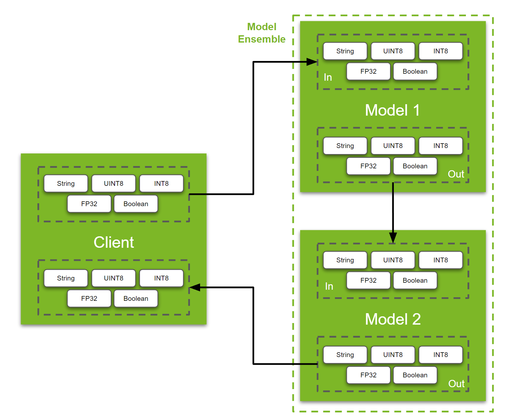

<!--
# Copyright 2023, NVIDIA CORPORATION & AFFILIATES. All rights reserved.
#
# Redistribution and use in source and binary forms, with or without
# modification, are permitted provided that the following conditions
# are met:
#  * Redistributions of source code must retain the above copyright
#    notice, this list of conditions and the following disclaimer.
#  * Redistributions in binary form must reproduce the above copyright
#    notice, this list of conditions and the following disclaimer in the
#    documentation and/or other materials provided with the distribution.
#  * Neither the name of NVIDIA CORPORATION nor the names of its
#    contributors may be used to endorse or promote products derived
#    from this software without specific prior written permission.
#
# THIS SOFTWARE IS PROVIDED BY THE COPYRIGHT HOLDERS ``AS IS'' AND ANY
# EXPRESS OR IMPLIED WARRANTIES, INCLUDING, BUT NOT LIMITED TO, THE
# IMPLIED WARRANTIES OF MERCHANTABILITY AND FITNESS FOR A PARTICULAR
# PURPOSE ARE DISCLAIMED.  IN NO EVENT SHALL THE COPYRIGHT OWNER OR
# CONTRIBUTORS BE LIABLE FOR ANY DIRECT, INDIRECT, INCIDENTAL, SPECIAL,
# EXEMPLARY, OR CONSEQUENTIAL DAMAGES (INCLUDING, BUT NOT LIMITED TO,
# PROCUREMENT OF SUBSTITUTE GOODS OR SERVICES; LOSS OF USE, DATA, OR
# PROFITS; OR BUSINESS INTERRUPTION) HOWEVER CAUSED AND ON ANY THEORY
# OF LIABILITY, WHETHER IN CONTRACT, STRICT LIABILITY, OR TORT
# (INCLUDING NEGLIGENCE OR OTHERWISE) ARISING IN ANY WAY OUT OF THE USE
# OF THIS SOFTWARE, EVEN IF ADVISED OF THE POSSIBILITY OF SUCH DAMAGE.
-->

# Understanding Data Pipelines

Learning about moving tensors from the client to the backends, and or moving it amongst the backends is a core skill needed to be built by Triton Users. In this tutorial, we will cover the following:

* The API used to move data between the client and server
* How to be proficient with the ensemble scheduler

**Note:** This example assumes that the reader has a basic understanding of how to use Triton Inference Server. If you are new to Triton Inference Server, refer to [Part 1 of the conceptual guide](https://github.com/triton-inference-server/tutorials/tree/main/Conceptual_Guide/Part_1-model_deployment) before proceeding.

## Overview of a dummy pipeline

The type of data you want to move depends on the type of pipeline you are building. Therefore there isn't a clean real-world example that can be used to cater to a wide audience. Therefore, this tutorial will simply demonstrate how to move a String, UINT8 & INT8 arrays, an FP32 image, and a Boolean through a dummy pipeline.

<p align="center" width="100%">
    
</p>

### Setting the Models & Ensemble

Before we go any further, let us set up the models. For the purposes of this demonstration, we are making use of a ["Python Model"](https://github.com/triton-inference-server/python_backend#python-backend). Python models in Triton are basically classes with three Triton-specific functions: `initialize`, `execute` and `finalize`. Users can customize this class to serve any python function they write or any model they want as long as it can be loaded in python runtime. The `initialize` function runs when the python model is loaded into memory, and the `finalize` function runs when the model is unloaded from memory. Both of these functions are optional to define. Again, to keep things simple for this example, we will just use the `execute` function to print the tensors they received by the "python model". Let's take a look at how it is done:

```
def execute(self, requests):
    responses = []
    for request in requests:
        inp = pb_utils.get_input_tensor_by_name(request, "model_1_input_string")
        inp2 = pb_utils.get_input_tensor_by_name(request, "model_1_input_UINT8_array")
        inp3 = pb_utils.get_input_tensor_by_name(request, "model_1_input_INT8_array")
        inp4 = pb_utils.get_input_tensor_by_name(request, "model_1_input_FP32_image")
        inp5 = pb_utils.get_input_tensor_by_name(request, "model_1_input_bool")

        print("Model 1 received", flush=True)
        print(inp.as_numpy(), flush=True)
        print(inp2.as_numpy(), flush=True)
        print(inp3.as_numpy(), flush=True)
        print(inp4.as_numpy(), flush=True)
        print(inp5.as_numpy(), flush=True)

        inference_response = pb_utils.InferenceResponse(output_tensors=[
            pb_utils.Tensor(
                "model_1_output_string",
                inp.as_numpy(),
            ),
            pb_utils.Tensor(
                "model_1_output_UINT8_array",
                inp2.as_numpy(),
            ),
            pb_utils.Tensor(
                "model_1_output_INT8_array",
                inp3.as_numpy(),
            ),
            pb_utils.Tensor(
                "model_1_output_FP32_image",
                inp4.as_numpy(),
            ),
            pb_utils.Tensor(
                "model_1_output_bool",
                inp5.as_numpy(),
            )
        ])
        responses.append(inference_response)
    return responses
```

There are two key points to note in this case: the `pb_utils.get_input_tensor_by_name(...)` and the `pb_utils.InferenceResponse(...)` function. These functions, as the name implies are used to receive and send tensors. Triton Inference Server supports a wide range of datatypes. In this example, we showcase 5 of them, but for a full list of supported datatypes, refer to the [documentation here](https://github.com/triton-inference-server/server/blob/main/docs/user_guide/model_configuration.md#datatypes). 

In the case of this model, the "input layers" are `model_1_input_string`, `model_1_input_UINT8_array`, `model_1_input_INT8_array`, `model_1_input_FP32_image` and `model_1_input_bool`. We define these along with the expected dimension and datatype in `config.pbtxt` for this model.
```
input [
  {
    name: "model_1_input_string"
    data_type: TYPE_STRING
    dims: [-1]
  },
  {
    name: "model_1_input_UINT8_array"
    data_type: TYPE_UINT8
    dims: [-1]
  },
  {
    name: "model_1_input_INT8_array"
    data_type: TYPE_INT8
    dims: [-1]
  },
  {
    name: "model_1_input_FP32_image"
    data_type: TYPE_FP32
    dims: [-1, -1, -1]
  },
  {
    name: "model_1_input_bool"
    data_type: TYPE_BOOL
    dims: [-1]
  }
]
```

Similarly, the "output layers" are `model_1_output_string`, `model_1_output_UINT8_array`, `model_1_output_INT8_array`, `model_1_output_FP32_image` and `model_1_output_bool` and they are defined in `config.pbtxt` as follows:

```
output [
  {
    name: "model_1_output_string"
    data_type: TYPE_STRING
    dims: [-1]
  },
  {
    name: "model_1_output_UINT8_array"
    data_type: TYPE_UINT8
    dims: [-1]
  },
  {
    name: "model_1_output_INT8_array"
    data_type: TYPE_INT8
    dims: [-1]
  },
  {
    name: "model_1_output_FP32_image"
    data_type: TYPE_FP32
    dims: [-1, -1, -1]
  },
  {
    name: "model_1_output_bool"
    data_type: TYPE_BOOL
    dims: [-1]
  }
]
```

**Note**: For a regular `onnx`, `torchscript`, `tensorflow` or any other model, we just need to define the input and output layers in `config.pbtxt`. The interaction between the ensemble and the client will remain the same. If you are unsure about the layers, dimensions and datatypes for your model, you can use tools like [Netron](https://netron.app/) or [Polygraphy](https://github.com/NVIDIA/TensorRT/tree/main/tools/Polygraphy) to get the required information.

The second model in this example is identical to the one above. We will use that model for showcasing the data flow in a [model ensemble](https://github.com/triton-inference-server/server/blob/main/docs/user_guide/architecture.md#ensemble-models). If you have already referred [Part-5 of the conceptual guide](https://github.com/triton-inference-server/tutorials/tree/main/Conceptual_Guide/Part_5-Model_Ensembles), then the following explanation of the ensembles might seem familiar. 

With the model setup discussed, let's discuss setting up an ensemble. Ensembles are used to build pipelines with two or more models. The benefit of using an ensemble is that the Triton Inference Server handles all the tensor/memory movement required between two models. Additionally, users can define a model flow using simple configuration files. This feature is especially useful for situations where users are setting up multiple pipelines with some common models shared among them.  

We will discuss the structure of the model repository a bit later. Let's jump into the configuration for the ensemble.

Since the flow is the same for all tensors, let's focus on the input string. The full configuration for the ensemble model looks something like below:

```
name: "ensemble_model"
platform: "ensemble"
max_batch_size: 8
input [
  {
    name: "ensemble_input_string"
    data_type: TYPE_STRING
    dims: [-1]
  },
  ...
]
output [
  {
    name: "ensemble_output_string"
    data_type: TYPE_STRING
    dims: [-1]
  },
  ...
]

ensemble_scheduling {
  step [
    {
      model_name: "model1"
      model_version: -1
      input_map {
        key: "model_1_input_string"
        value: "ensemble_input_string"
      },
      ...
      
      output_map {
        key: "model_1_output_string"
        value: "model1_to_model2_string"
      },
      ...

    },
    {
      model_name: "model2"
      model_version: -1
      input_map {
        key: "model_2_input_string"
        value: "model1_to_model2_string"
      },
      ...

      output_map {
        key: "model_2_output_string"
        value: "ensemble_output_string"
      },
      ...

    }
  ]
```

Let's break it down: First, we define the input and output of the overall ensemble.
```
input [
  {
    name: "ensemble_input_string"
    data_type: TYPE_STRING
    dims: [-1]
  },
  ...
]
output [
  {
    name: "ensemble_output_string"
    data_type: TYPE_STRING
    dims: [-1]
  },
  ...
]
```
This is similar to defining the input and output layers in a regular model. Next. we define the exact flow of the ensemble. The flow is composed of "steps", where each step defines the inputs/outputs and the model to execute at this step.
```
ensemble_scheduling {
  step [
    {
      model_name: "model1"
      model_version: -1
      ...

    },
    {
      model_name: "model2"
      model_version: -1
      ...

    }
  ]
```
The first part that a user needs to understand is how to define the general flow of their ensemble pipeline. For example, which model needs to run first? Then, how do the tensors flow between each model/step? To define this, we use `input_map` and `output_map`.

```
ensemble_scheduling {
  step [
    {
      model_name: "model1"
      model_version: -1
      input_map {
        key: "model_1_input_string"       # Model 1's input Tensor
        value: "ensemble_input_string"    # this is the name of the ensemble's input
      },
      ...
      
      output_map {
        key: "model_1_output_string"      # Model 1's output Tensor
        value: "model1_to_model2_string"  # Mapping output from Model1 to Model2
      },
      ...

    },
    {
      model_name: "model2"
      model_version: -1
      input_map {
        key: "model_2_input_string"       # Model 2's input Tensor
        value: "model1_to_model2_string"  # Mapping output from Model1 to Model2
      },
      ...

      output_map {
        key: "model_2_output_string"      # Model 2's output Tensor
        value: "ensemble_output_string"   # this is the name of the ensemble's output
      },
      ...

    }
  ]
```
Before proceeding let's build an intuition about how to define the `key` and the `value` fields. The `key` field is populated using the names of the layers the models require. The field `value` is recognized by the ensemble. This field is used to define the flow of the tensors. So if you want to move the output of one of the layers of a model to input of another model, you need to use the `value` in the `output_map` of `model1` as the `value` in the `input_map` of `model2`.

With the individual configurations understood let's briefly look at the structure of the model repository for this example. Essentially we have two models 
```
model_repository/
├── ensemble_model
│   ├── 1               # Empty version folder required for ensemble models
│   └── config.pbtxt    # Config for the Ensemble
├── model1
│   ├── 1
│   │   └── model.py
│   └── config.pbtxt    # Config for model 1
└── model2
    ├── 1
    │   └── model.py
    └── config.pbtxt    # Config for model 2
```

### Understanding the Python Client

With the server side set up, let's discuss the client code.
```
def main():
    client = httpclient.InferenceServerClient(url="localhost:8000")

    # Inputs
    prompts = ["This is a string"]
    text_obj = np.array([prompts], dtype="object")

    url = "http://images.cocodataset.org/val2017/000000039769.jpg"
    image = np.asarray(Image.open(requests.get(url, stream=True).raw)).astype(np.float32)
    uint8_array = np.expand_dims(np.array([1,2,3], dtype = np.uint8), axis = 0)
    int8_array = np.expand_dims(np.array([-1,2,-3], dtype = np.int8), axis = 0)
    image = np.expand_dims(image, axis=0)
    boolean = np.expand_dims(np.array([True]), axis = 0)

    # Set Inputs
    input_tensors = [
        httpclient.InferInput("ensemble_input_string", text_obj.shape,np_to_triton_dtype(text_obj.dtype)),
        httpclient.InferInput("ensemble_input_UINT8_array", uint8_array.shape, datatype="UINT8"),
        httpclient.InferInput("ensemble_input_INT8_array", int8_array.shape, datatype="INT8"),
        httpclient.InferInput("ensemble_input_FP32_image", image.shape, datatype="FP32"),
        httpclient.InferInput("ensemble_input_bool", boolean.shape, datatype="BOOL")
    ]
    input_tensors[0].set_data_from_numpy(text_obj)
    input_tensors[1].set_data_from_numpy(uint8_array)
    input_tensors[2].set_data_from_numpy(int8_array)
    input_tensors[3].set_data_from_numpy(image)
    input_tensors[4].set_data_from_numpy(boolean)

    # Set outputs
    output = [
        httpclient.InferRequestedOutput("ensemble_output_string"),
        httpclient.InferRequestedOutput("ensemble_output_UINT8_array"),
        httpclient.InferRequestedOutput("ensemble_output_INT8_array"),
        httpclient.InferRequestedOutput("ensemble_output_FP32_image"),
        httpclient.InferRequestedOutput("ensemble_output_bool")
    ]

    # Query
    query_response = client.infer(model_name="ensemble_model",
                                  inputs=input_tensors,
                                  outputs=output)

    print(query_response.as_numpy("ensemble_output_string"))
    print(query_response.as_numpy("ensemble_output_UINT8_array"))
    print(query_response.as_numpy("ensemble_output_INT8_array"))
    print(query_response.as_numpy("ensemble_output_FP32_image"))
    print(query_response.as_numpy("ensemble_output_bool"))
```

Let's look at setting the input and output.
```
# Input
input_tensors = [
    httpclient.InferInput("ensemble_input_string", text_obj.shape,np_to_triton_dtype(text_obj.dtype)),
    httpclient.InferInput("ensemble_input_UINT8_array", uint8_array.shape, datatype="UINT8"),
    httpclient.InferInput("ensemble_input_INT8_array", int8_array.shape, datatype="INT8"),
    httpclient.InferInput("ensemble_input_FP32_image", image.shape, datatype="FP32"),
    httpclient.InferInput("ensemble_input_bool", boolean.shape, datatype="BOOL")
]
input_tensors[0].set_data_from_numpy(text_obj)
input_tensors[1].set_data_from_numpy(uint8_array)
input_tensors[2].set_data_from_numpy(int8_array)
input_tensors[3].set_data_from_numpy(image)
input_tensors[4].set_data_from_numpy(boolean)

# Output
output = [
    httpclient.InferRequestedOutput("ensemble_output_string"),
    httpclient.InferRequestedOutput("ensemble_output_UINT8_array"),
    httpclient.InferRequestedOutput("ensemble_output_INT8_array"),
    httpclient.InferRequestedOutput("ensemble_output_FP32_image"),
    httpclient.InferRequestedOutput("ensemble_output_bool")
]

```
In this case, we are using the `http` client, and specifying the names of the inputs and outputs along with the expected datatype. Notice that in this case, we are using the ensemble inputs/outputs, for instance `ensemble_input_string` for the string input to the ensemble. If you want to query one of the composing models individually, you can change the input names, output names, and model name to match the desired model.

```
# Creating a client for the server
client = httpclient.InferenceServerClient(url="localhost:8000")

# Querying the Server
query_response = client.infer(model_name="ensemble_model",
                                inputs=input_tensors,
                                outputs=output)

print(query_response.as_numpy("ensemble_output_string"))
print(query_response.as_numpy("ensemble_output_UINT8_array"))
print(query_response.as_numpy("ensemble_output_INT8_array"))
print(query_response.as_numpy("ensemble_output_FP32_image"))
print(query_response.as_numpy("ensemble_output_bool"))
```

## Using the example

To run this example, open two terminals.
```
# Server

cd /path/to/this/folder
# Replace yy.mm with year and month of release. Eg. 23.02
docker run --gpus=all -it --shm-size=256m --rm -p8000:8000 -p8001:8001 -p8002:8002 -v ${PWD}:/workspace/ -v ${PWD}/model_repository:/models nvcr.io/nvidia/tritonserver:yy.mm-py3 bash
tritonserver --model-repository=/models
```
The above will launch the Triton Inference Server. In the second terminal, we will run our client script:
```
# Client

cd /path/to/this/folder
# Replace yy.mm with year and month of release. Eg. 23.02
docker run -it --net=host -v ${PWD}:/workspace/ nvcr.io/nvidia/tritonserver:yy.mm-py3-sdk bash
pip install image
python3 client.py
```

Does your ensemble have a conditional flow? Check out [this example](https://github.com/triton-inference-server/tutorials/tree/main/Conceptual_Guide/Part_6-building_complex_pipelines) and the [documentation](https://github.com/triton-inference-server/python_backend#business-logic-scripting) for Business Logic Scripting API!
