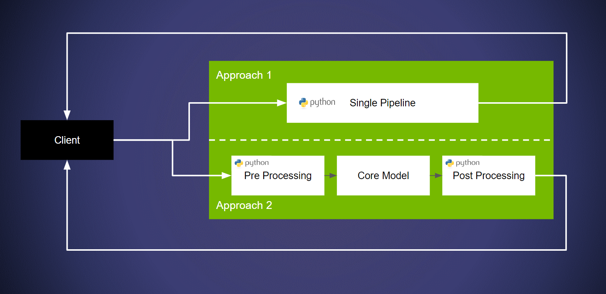
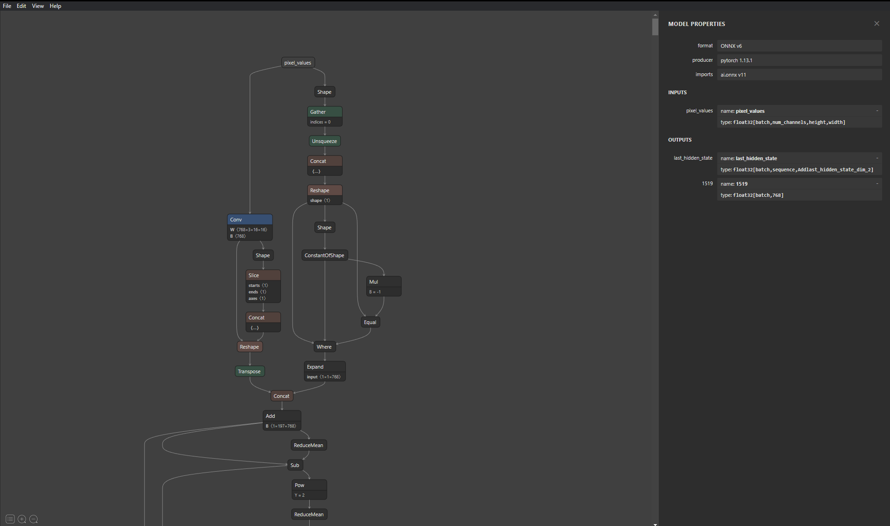

<!-- 
# Copyright 2023, NVIDIA CORPORATION & AFFILIATES. All rights reserved.
#
# Redistribution and use in source and binary forms, with or without
# modification, are permitted provided that the following conditions
# are met:
#  * Redistributions of source code must retain the above copyright
#    notice, this list of conditions and the following disclaimer.
#  * Redistributions in binary form must reproduce the above copyright
#    notice, this list of conditions and the following disclaimer in the
#    documentation and/or other materials provided with the distribution.
#  * Neither the name of NVIDIA CORPORATION nor the names of its
#    contributors may be used to endorse or promote products derived
#    from this software without specific prior written permission.
#
# THIS SOFTWARE IS PROVIDED BY THE COPYRIGHT HOLDERS ``AS IS'' AND ANY
# EXPRESS OR IMPLIED WARRANTIES, INCLUDING, BUT NOT LIMITED TO, THE
# IMPLIED WARRANTIES OF MERCHANTABILITY AND FITNESS FOR A PARTICULAR
# PURPOSE ARE DISCLAIMED.  IN NO EVENT SHALL THE COPYRIGHT OWNER OR
# CONTRIBUTORS BE LIABLE FOR ANY DIRECT, INDIRECT, INCIDENTAL, SPECIAL,
# EXEMPLARY, OR CONSEQUENTIAL DAMAGES (INCLUDING, BUT NOT LIMITED TO,
# PROCUREMENT OF SUBSTITUTE GOODS OR SERVICES; LOSS OF USE, DATA, OR
# PROFITS; OR BUSINESS INTERRUPTION) HOWEVER CAUSED AND ON ANY THEORY
# OF LIABILITY, WHETHER IN CONTRACT, STRICT LIABILITY, OR TORT
# (INCLUDING NEGLIGENCE OR OTHERWISE) ARISING IN ANY WAY OUT OF THE USE
# OF THIS SOFTWARE, EVEN IF ADVISED OF THE POSSIBILITY OF SUCH DAMAGE.
-->

# Deploying HuggingFace models

**Note**: If you are new to the Triton Inference Server, it is recommended to review [Part 1 of the Conceptual Guide](../Conceptual_Guide/Part_1-model_deployment/README.md). This tutorial assumes basic understanding about the Triton Inference Server.

|Related Pages | HuggingFace model exporting guide: [ONNX](https://huggingface.co/docs/transformers/serialization), [TorchScript](https://huggingface.co/docs/transformers/torchscript) |
| ------------ | --------------- |

Developers often work with open source models. HuggingFace is a popular source of many open source models. The discussion in this guide will focus on how a user can deploy almost any model from HuggingFace with the Triton Inference Server. For this example, the [ViT](https://arxiv.org/abs/2010.11929) model available on [HuggingFace](https://huggingface.co/docs/transformers/v4.24.0/en/model_doc/vit#transformers.ViTModel) is being used.

There are two primary methods of deploying a model pipeline on the Triton Inference Server:
* **Approach 1:** Deploy the pipeline without explicitly breaking apart model from a pipeline. The core advantage of this approach is that users can quickly deploy their pipeline. This can be achieved with the use of Triton's ["Python Backend"](https://github.com/triton-inference-server/python_backend). Refer [this example](https://github.com/triton-inference-server/python_backend#usage) for more information. In summary, we deploy the model/pipeline using the Python Backend.

* **Approach 2:** Break apart the pipeline, use a different backends for pre/post processing and deploying the core model on a framework backend. The advantage in this case is that running the core network on a dedicated framework backend provides higher performance. Additionally, many framework specific optimizations can be leveraged. See [Part 4](../Conceptual_Guide/Part_4-inference_acceleration/README.md) of the conceptual guide for more information. This is achieved with Triton's Ensembles. An explanation for the same can be found in [Part 5](../Conceptual_Guide/Part_5-Model_Ensembles/README.md) of the Conceptual Guide. Refer to the documentation for more [information](https://github.com/triton-inference-server/server/blob/main/docs/user_guide/architecture.md#ensemble-models). In summary, we build an ensemble with a preprocessing step and the exported model.



## Examples

For the purposes of this explanation, the `ViT` model([Link to HuggingFace](https://huggingface.co/docs/transformers/v4.24.0/en/model_doc/vit#transformers.ViTModel)) is being used. This specific ViT model doesn't have an application head (like image classification) but [HuggingFace provides](https://huggingface.co/models?search=google/vit) ViT models with different heads which users can utilize. A good practice while deploying models is to understand the and explore the structure of the model if you are unfamiliar with it. An easy way to see the structure with a graphical interface is by using tools like [Netron](https://netron.app/). While Triton autogenerates configuration files for the models, the users may still require names of the input and output layers to build clients/model ensembles for which we can use this tool. 



### Deploying on the Python Backend (Approach 1)

Making use of Triton's python backend requires users to define up to three functions of the `TritonPythonModel` class:
* `initialize()`: This function runs when Triton loads the model. It is recommended to use this function to initialize/load any models and/or data objects. Defining this function is optional.
```
def initialize(self, args):
    self.feature_extractor = ViTFeatureExtractor.from_pretrained('google/vit-base-patch16-224-in21k')
    self.model = ViTModel.from_pretrained("google/vit-base-patch16-224-in21k")
```
* `execute()`: This function is executed upon every request. This can be used to house all the required pipeline logic.
```
def execute(self, requests):
    responses = []
    for request in requests:
        inp = pb_utils.get_input_tensor_by_name(request, "image")
        input_image = np.squeeze(inp.as_numpy()).transpose((2,0,1))
        inputs = self.feature_extractor(images=input_image, return_tensors="pt")

        outputs = self.model(**inputs)

        # Sending results
        inference_response = pb_utils.InferenceResponse(output_tensors=[
            pb_utils.Tensor(
                "label",
                outputs.last_hidden_state.numpy()
            )
        ])
        responses.append(inference_response) 
    return responses
```
* `finialize()`: This function is executed when Triton unloads the model. It can be used to free any memory, or any other operations required to safely unload the model. Defining this function is optional.

To run this example open two terminals and use the following commands:
* **Terminal 1**: This terminal will be used to launch the Triton Inference Server.
```
# Pick the pre-made model repository
mv python_model_repository model_repository

# Pull and run the Triton container & replace yy.mm 
# with year and month of release. Eg. 23.05
docker run --gpus=all -it --shm-size=256m --rm -p8000:8000 -p8001:8001 -p8002:8002 -v ${PWD}:/workspace/ -v ${PWD}/model_repository:/models nvcr.io/nvidia/tritonserver:yy.mm-py3 bash

# Install dependencies
pip install torch torchvision
pip install transformers
pip install Image

# Launch the server
tritonserver --model-repository=/models
```
* **Terminal 2**: This terminal will be used to run the client.
```
# Pull & run the container
docker run -it --net=host -v ${PWD}:/workspace/ nvcr.io/nvidia/tritonserver:yy.mm-py3-sdk bash

# Run the client

python3 client.py --model_name "python_vit"
```

### Deploying using a Triton Ensemble (Approach 2)

Before the specifics around deploying the models can be discussed, the first step is to download and export the model. It is recommended to run the following inside the [PyTorch container available on NGC](https://catalog.ngc.nvidia.com/orgs/nvidia/containers/pytorch). If this is your first try at setting up a model ensemble in Triton, it is highly recommended to review [this guide](../Conceptual_Guide/Part_5-Model_Ensembles/README.md) before proceeding. The key advantages of breaking down the pipeline is improved performance and access to a multitude of acceleration options. Explore [Part-4](../Conceptual_Guide/Part_4-inference_acceleration/README.md) of the conceptual guide for details about model acceleration.
  
```
# Pull the PyTorch Container from NGC
docker run -it --gpus=all -v ${PWD}:/workspace nvcr.io/nvidia/pytorch:23.05-py3

# Install dependencies
pip install transformers
pip install transformers[onnx]

# Export the model
python -m transformers.onnx --model=google/vit-base-patch16-224 --atol=1e-3 onnx/vit
```

With the model downloaded, set up the model repository in the structure described below. The basic structure of the model repository along with the required configuration files are available in `ensemble_model_repository`. 
```
model_repository/
|-- ensemble_model
|   |-- 1
|   `-- config.pbtxt
|-- preprocessing
|   |-- 1
|   |   `-- model.py
|   `-- config.pbtxt
`-- vit
    `-- 1
        `-- model.onnx
```

In this approach, there are three points to consider.
* **Preprocessing**: The feature extraction step for ViT is done on a python backend. The implementation details for this step are same as the process followed in the [section above](#deploying-on-the-python-backend).
* **The ViT model**: Simply place the model in the repository as described above. The Triton Inference Server will auto generate the required configurations files. If you wish to see the generated config, append `--log-verbose=1` while launching the server.
* **Ensemble Configuration**: In this configuration we map the input and output layers of the two pieces in the ensemble, `preprocessing` which is handled on the python backend, and the ViT model which is deployed on the ONNX backend.

To run this example, similar to the previous flow, make use of two terminals:
* **Terminal 1**: This terminal will be used to launch the Triton Inference Server.

```
# Pick the pre-made model repository and add the model
mv ensemble_model_repository model_repository
mkdir -p model_repository/vit/1
mv vit/model.onnx model_repository/vit/1/
mkdir model_repository/ensemble_model/1

# Pull and run the Triton container & replace yy.mm 
# with year and month of release. Eg. 23.05
docker run --gpus=all -it --shm-size=256m --rm -p8000:8000 -p8001:8001 -p8002:8002 -v ${PWD}:/workspace/ -v ${PWD}/model_repository:/models nvcr.io/nvidia/tritonserver:yy.mm-py3 bash

# Install dependencies
pip install torch torchvision torchaudio
pip install transformers
pip install Image

# Launch the server
tritonserver --model-repository=/models
```
* **Terminal 2**: This terminal will be used to run the client.
```
# Pull & run the container
docker run -it --net=host -v ${PWD}:/workspace/ nvcr.io/nvidia/tritonserver:yy.mm-py3-sdk bash

# Run the client
python3 client.py --model_name "ensemble_model"
```

## Summary

In summary, there are two methods in which most HuggingFace models can be deployed, either deploy the entire pipeline on a python backend, or construct and ensemble.

