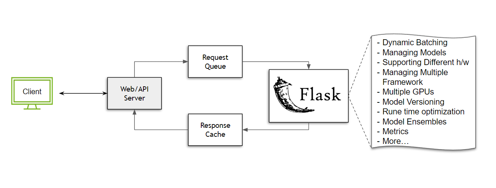

# Migrating to the Triton Inference Server

Migrating to a new inference stack may seem challenging, but the task can be understood by breaking down the challenges and understanding the best practices. In this guide, we show some of the benefits of using a dedicated inference serving solution like the Triton Inference Server and cover which path may best suit your Triton adoption.

## Why do we need a dedicated inference solution?

Building out the infrastructure needed to serve inference can be quite complicated. Let's consider a simple case where we don't have any scaling, and are operating on a single node with no load balancers required. What do we need to serve a model?

If you are working with Python, and are new to the model inference space, or just want to build something out quickly, you might turn to a tool like [Flask](https://flask.palletsprojects.com/en/2.2.x/): a versatile micro-framework, giving you the freedom to build out the ecosystem as needed. To serve anything in flask, all you need is a function that can handle the POST requests coming in.

```python
@app.route('/run_my_model',methods=['POST'])
def predict():
    data = request.get_json(force=True)

    # Pre-processing
    ...

    prediction = model(<data>)

    # Post-processing
    ...

    return output
```

In just a few lines of code, we have our model up and running. Anyone can send a request and use the model! But wait, what happens when we start receiving multiple requests? We need a way to queue these tasks/requests. Let's say we make use of [Celery](https://docs.celeryq.dev/en/stable/getting-started/introduction.html) and solve this queuing challenge. While we are at it, we can also build a response cache to address repeat queries.



While the above set up does work, it is very restrictive and resource inefficient. How? Let's say that we were working with an image classification model which has a maximum batch size of `64`, and our server receives `50` requests every `100 ms`. Without implementing any form of batching strategy, all these requests will have to be processed sequentially, wasting GPU resources. This is just the tip of the iceberg. Consider the following cases:
* What if we want to support multiple models. Do we need to restart the server every time we have to update a model?
* How do we version a model?
* Can we serve a PyTorch and a TensorFlow model on the same server?
* What if one model needs to run on CPU and the other needs a GPU. How do we optimize for execution?
* How do we manage multiple GPUs on the same node?
* Is our execution run time optimized? Are we handling the I/O efficiently?
* How do we work with a model ensemble?
* What is the best way to monitor server metrics?

These are just some of the considerations we have to make, and invest engineering time into building out. Additionally these features will have to be regularly maintained and optimized for each major version of a software and hardware accelerator or execution context. These challenges only become more severe as the deployment scales. Clearly, the solution can't be that every developer starts with a multipurpose framework and spend resources building out and maintaining infrastructure. This is where having a purpose built inference server like Triton Inference Server solves a lot of problems.

## How do I migrate my workflow to Triton?

This guide assumes an understanding of the basics of the Triton Inference Server on a conceptual level. If you are new to the Triton Inference Server, you may want to check out this [getting started video](https://www.youtube.com/watch?v=NQDtfSi5QF4) and this [guide](../Conceptual_Guide/Part_1-model_deployment/README.md) first.

Every existing inference pipeline is unique, thus a there is no "one size fits all" solution to migrate your current stack to the Triton Inference Server. That said, this guide will attempt at building intuition for easing the migration process. Broadly speaking, there are four general categories that most inference stacks fall into.

* **Tightly coupled with a larger module**: Maybe you are in the process of iterating or fine tuning a model where decoupling the model from an existing stack will require considerable effort. You still need the better performance to use as few hardware resources as possible and share your dev branch with internal teams. The effort required to isolate dependencies, export the models, set up some form of store, etc. aren't feasible. What you need is a solution which you can inject into your existing codebase that won't be invasive or time consuming.

    In this case, we recommend using [PyTriton](https://github.com/triton-inference-server/pytriton), which is a Flask/FastAPI like interface with which users can leverage the Triton Inference Server for their use case.

    ```python
    from pytriton.decorators import sample
    from pytriton.model_config import ModelConfig, Tensor
    from pytriton.triton import Triton

    MODEL = ...

    @sample
    def <your_function_name>(sequence: np.ndarray, labels: np.ndarray):
        # Decode input
        sequence = np.char.decode(sequence.astype("bytes"), "utf-8")
        labels = np.char.decode(labels.astype("bytes"), "utf-8")

        result = MODEL(...)

        return {"scores": results}

    # PyTriton code
    with Triton() as triton:
        triton.bind(
            model_name="<model name>",
            infer_func=<your_function_name>,      # function you want to serve
            inputs=[
                Tensor(name="sequence", dtype=bytes, shape=(1,)),
                Tensor(name="labels", dtype=bytes, shape=(-1,)),
            ],
            outputs=[
                Tensor(name="scores", dtype=np.float32, shape=(-1,)),
            ],
            # add the features you want to enable here
            config=ModelConfig(batching=False),
        )
        triton.serve()
    ```

    The example above is a skeleton version of [this example](https://github.com/triton-inference-server/pytriton/tree/main/examples/huggingface_bart_pytorch). The key point to note is that any function you wish to serve, whether it has a model inference component or just some python code, can be bound to Triton. As a user, you don't have to worry about bringing up a Triton Inference Server or building a model repository, all of the steps required are handled by the PyTriton Library. More information about the architecture can be [found here](https://github.com/triton-inference-server/pytriton#architecture).

* **Loosely coupled, but a tangled pipeline**: Let's say that the pipeline you are serving can be isolated into a different environment. Users are typically at this stage when the models and the pipelines are internally tested and they generate satisfactory results. They still may be working with tangled pipelines where some of the models can't be exported and pre/post processing steps are still tightly coupled with the pipeline logic.

    In this case users can still make use of pytriton, but if some of the models are exportable, users can get higher performance by using Triton's Python Backend along with other framework backends. [Part 6](../Conceptual_Guide/Part_6-building_complex_pipelines/README.md) of the conceptual guide is an excellent example for this case.

    Currently, not all of Triton Inference Server's features can be leveraged using the PyTriton. Users can also choose to use the Python backend to utilize the full feature set the Triton Inference Server has to offer. This [HuggingFace example](../HuggingFace/README.md#deploying-on-the-python-backend) can walk you through the specifics.

* **Loosely coupled, modular pipeline**: With increasing complexity of pipelines, there is often a case where there are sizable overlaps in a deep learning pipeline, i.e., multiple pipelines are using a common set of models or pre/post processing steps. In these cases, it is extremely beneficial deploy all the components of the pipelines on the Triton Inference Server and then [build model ensembles](https://github.com/triton-inference-server/server/blob/main/docs/user_guide/architecture.md#ensemble-models). Even for a case where there aren't overlaps, using Triton's model ensembles to manage pipelines provides scaling and performance benefits. For an in-depth explanation, refer [this guide](../Conceptual_Guide/Part_5-Model_Ensembles/README.md).

* **Deploying individual models without pre/post processing**: In many cases, the pipeline logic exists in the form of extremely optimized low level scripts that have been built over years of development. In this case, users may prefer to deploy just the models and avoid the HTTP/gRPC network calls as the model is being consumed by a larger applications. For this case, the models can be accessed using Triton's [shared memory extensions](https://github.com/triton-inference-server/server/blob/main/docs/protocol/extension_shared_memory.md#shared-memory-extension) and the [C API](https://github.com/triton-inference-server/server/blob/main/docs/customization_guide/inference_protocols.md#in-process-triton-server-api), removing the need for a network interface.

## Conclusion

While there are many ways in which models can be deployed, each case presents its own challenges and requirements. These requirements can be met by using various Triton Inference Server features. We encourage you to explore the Triton Inference Server [documentation](https://docs.nvidia.com/deeplearning/triton-inference-server/user-guide/docs/index.html) to find more details about the features!
